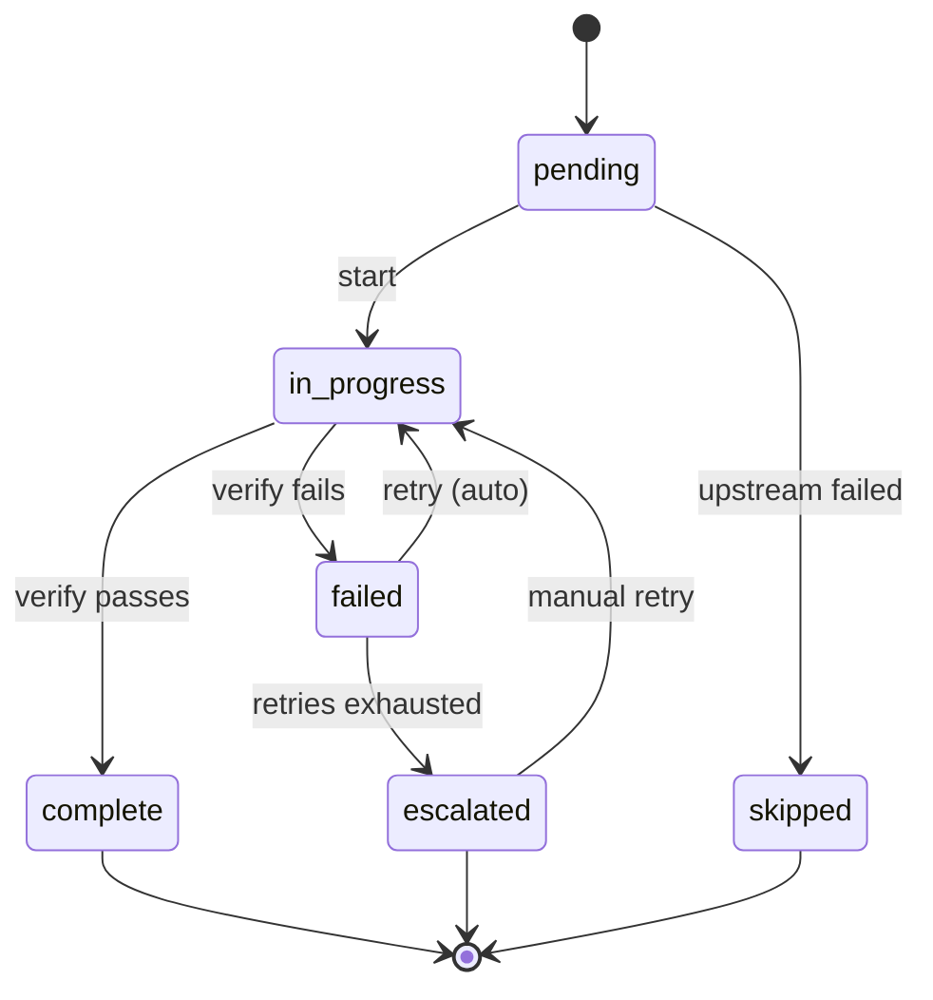
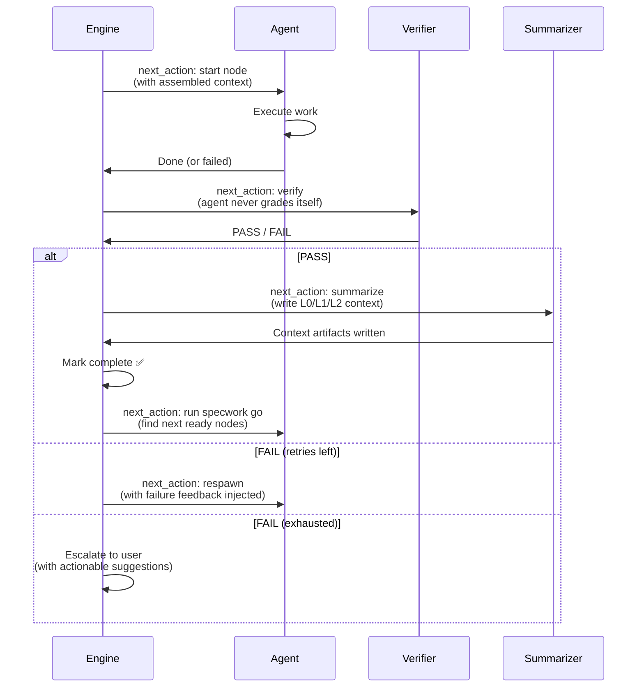
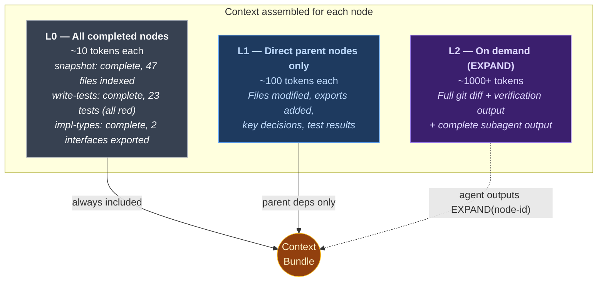
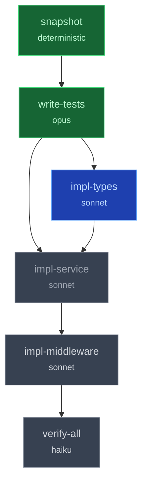

<div align="center">

# Specwork

### Stop babysitting your AI agent.

[](https://www.npmjs.com/package/specwork)
[](LICENSE)
[](https://nodejs.org)

*A spec-driven workflow engine that keeps AI agents focused, verified, and honest — from first test to final commit.*

</div>

---

## You've been here before

You ask your AI agent to add authentication to your API. It starts strong — writes a few files, sets up a middleware. Then somewhere around step 4, it quietly modifies your database schema. By step 7, it's forgotten why it started. You scroll through 200 lines of changes and realize half of them are wrong.

You re-explain the goal. It apologizes. It drifts again.

**The bigger the task, the worse this gets.** Context fades. Tests get skipped "to save time." You end up doing more work managing the agent than you would have writing the code yourself.

This is the problem Specwork was built to solve.

---

## The core idea: a workflow engine for AI agents

Specwork doesn't give the agent a plan and hope for the best. It runs a **state machine** — each unit of work is a node that transitions through a strict lifecycle. The agent never sees the full workflow. It receives one instruction at a time, embedded in the output of each CLI command.



Every transition produces a **`next_action`** — a concrete instruction telling the agent exactly what to do next. The agent doesn't plan. It doesn't improvise. It follows `next_action`.

---

## How `next_action` drives everything

When the agent runs any `specwork` command, the JSON response includes a `next_action` field. This is the engine's steering wheel. The agent reads it, executes it, and the cycle repeats.

```
┌──────────────────────────────────────────────────────────────────┐
│                                                                  │
│   Agent runs command  ──►  Engine returns next_action            │
│          ▲                          │                            │
│          │                          ▼                            │
│          └────────  Agent executes next_action                   │
│                                                                  │
└──────────────────────────────────────────────────────────────────┘
```

Here's what that looks like in practice. The agent runs `specwork go`:

```json
{
  "status": "ready",
  "ready": ["write-tests", "impl-types"],
  "progress": { "complete": 1, "total": 6, "failed": 0 },
  "next_action": {
    "command": "team:spawn",
    "description": "Spawn one teammate per ready node: write-tests, impl-types",
    "context": "Add JWT authentication to the API"
  }
}
```

The agent doesn't need memory of the overall plan. It reads `command`, sees `"team:spawn"`, spawns the teammates. Done. When a teammate finishes, it runs verify:

```json
{
  "verdict": "PASS",
  "next_action": {
    "command": "subagent:spawn",
    "description": "Spawn summarizer to write L0/L1/L2 context, then complete the node.",
    "on_pass": "specwork node complete add-jwt-auth impl-types",
    "on_fail": "specwork node fail add-jwt-auth impl-types --reason '<error>'"
  }
}
```

And when verification fails:

```json
{
  "verdict": "FAIL",
  "checks": [
    { "type": "tests-pass", "status": "FAIL", "detail": "3 of 12 tests failing" }
  ],
  "next_action": {
    "command": "subagent:respawn",
    "description": "1 retry remaining. Re-spawn with failure feedback.",
    "context": "Add JWT authentication to the API"
  }
}
```

Notice: every response carries `context` — the original goal, pulled from your description. At every state transition, the agent is reminded *why* it's doing what it's doing. The goal never fades.

---

## The node lifecycle

Every node — whether it's writing tests, implementing code, or running a shell command — follows the same lifecycle:



Two critical rules:

1. **The implementer never grades its own homework.** After every node, a separate verifier agent checks the work — type errors, test results, file existence.
2. **Tests before implementation.** The `write-tests` node always runs first. Tests must fail (red state) before any implementation begins.

---

## Progressive context: how nodes share knowledge

When a subagent starts working on a node, it doesn't receive the full conversation history. It gets exactly what it needs — through a three-tier context system:



**Why this matters:** A 10-node workflow could easily consume 50K+ tokens of context if you dump everything. With L0/L1/L2, the same workflow uses ~2K tokens per node — and the agent can pull in L2 for a specific node if it genuinely needs the full details.

Here's what the assembled context looks like when `impl-service` starts:

```
## Completed Nodes (L0)
- snapshot: complete, 47 files indexed
- write-tests: complete, 23 tests written (all red)
- impl-types: complete, 2 interfaces exported

## Parent Context (L1)

### write-tests
Files: src/__tests__/auth.test.ts
Tests: 0/23 passing (all red as expected)

### impl-types
Files: src/types/auth.ts
Exports: JwtPayload, AuthConfig
Decision: Used discriminated union for token types

## Your Task
Implement the auth service. Make all tests in auth.test.ts pass.
```

The subagent knows what exists, what was decided, and what to build — without wading through thousands of lines of diff output.

---

## Walking the graph

Specwork models your change as a DAG (directed acyclic graph). The engine walks it automatically — finding nodes whose dependencies are all complete, spawning agents in parallel when possible.



```
specwork go add-jwt-auth --json
```

The engine scans all nodes:
- **`snapshot`**, **`write-tests`** — complete, skip
- **`impl-types`** — in progress, wait
- **`impl-service`** — pending, but `impl-types` isn't done yet — **blocked**
- **`impl-middleware`**, **`verify-all`** — deeper in the graph — **blocked**

Response: `"status": "waiting"` with `next_action: "wait"`. When `impl-types` completes, the next `specwork go` call finds `impl-service` ready and spawns it.

If a node fails and exhausts its retries, the engine **cascades skip** — all downstream nodes that depend on the failed node are marked `skipped`, so the agent doesn't waste time on work that can't succeed.

---

## Quick start

**Prerequisites:** [Claude Code](https://docs.anthropic.com/en/docs/claude-code) with Agent Teams support + Node.js >= 18

```bash
# Install
npm install -g specwork

# Initialize (one-time, in your project root)
specwork init

# Plan a change
specwork plan "Add JWT authentication to the API"

# Run the workflow
specwork go add-jwt-authentication

# Check progress anytime
specwork status
```

Or use Claude Code slash commands:

```
/specwork-plan "Add JWT authentication"
/specwork-go add-jwt-authentication
/specwork-status
```

---

<details>
<summary><h2>CLI Reference</h2></summary>

| Command                                  | Description                                                         |
| ---------------------------------------- | ------------------------------------------------------------------- |
| `specwork init`                          | Initialize project (creates `.specwork/` + Claude Code integration) |
| `specwork plan "<description>"`          | Create a new change from plain English                              |
| `specwork go <change>`                   | Run the workflow autonomously                                       |
| `specwork status [change]`               | Show progress for all or a specific change                          |
| `specwork graph generate <change>`       | Generate DAG from tasks                                             |
| `specwork graph show <change>`           | Display the node graph                                              |
| `specwork node start <change> <node>`    | Start a specific node                                               |
| `specwork node complete <change> <node>` | Mark a node complete                                                |
| `specwork node fail <change> <node>`     | Mark a node failed                                                  |
| `specwork node verify <change> <node>`   | Run verification checks                                             |
| `specwork archive <change>`              | Archive a completed change                                          |
| `specwork doctor [change]`               | Health-check project or change artifacts                            |

All commands support `--json` for machine-readable output with `next_action` guidance.

</details>

<details>
<summary><h2>Architecture</h2></summary>

```
.specwork/
├── config.yaml              # Engine + spec configuration
├── specs/                   # Source-of-truth behavior specs
├── changes/                 # In-flight changes (proposal + specs + design + tasks)
│   └── <change-name>/
├── graph/<change>/
│   ├── graph.yaml           # Node DAG (dependencies, validation rules)
│   └── state.yaml           # Runtime state (status per node)
├── nodes/<change>/          # Per-node artifacts (L0/L1/L2, verify output)
└── templates/               # Starter templates for proposals, specs, design, tasks

.claude/
├── agents/                  # Subagent definitions (test-writer, implementer, verifier, summarizer)
├── skills/                  # Engine logic (specwork-engine, specwork-context)
├── commands/                # Slash commands (specwork-plan, specwork-go, specwork-status)
└── hooks/                   # Lifecycle hooks (type-check, node-complete)
```

### Subagents

| Agent                  | Model  | Role                                                      |
| ---------------------- | ------ | --------------------------------------------------------- |
| `specwork-test-writer` | opus   | Writes tests from specs — must all fail (RED)             |
| `specwork-implementer` | sonnet | Makes tests pass, minimum code                            |
| `specwork-verifier`    | haiku  | Read-only validation: type-check, tests pass, files exist |
| `specwork-summarizer`  | haiku  | Generates L0/L1/L2 context after each node                |

### Node types

- **`deterministic`** — Runs a shell command. Captures stdout/stderr, validates exit code.
- **`llm`** — Spawns a subagent with validation rules.
- **`human`** — Pauses execution for manual approval.

### State machine

Every node tracks: `status`, `retries`, `verified`, `l0` (headline), `start_sha` (git ref), and a full `verify_history` with regression detection.

Terminal states: `complete`, `skipped`, `rejected`. Retryable: `failed` → `in_progress`. Escalatable: `escalated` → `in_progress` (manual).

</details>

<details>
<summary><h2>Configuration</h2></summary>

`.specwork/config.yaml`:

```yaml
models:
  default: sonnet
  test_writer: opus
  verifier: haiku
  summarizer: haiku

execution:
  max_retries: 2
  expand_limit: 1
  parallel_mode: parallel
  snapshot_refresh: after_each_node

context:
  ancestors: L0
  parents: L1

spec:
  specs_dir: .specwork/specs
  changes_dir: .specwork/changes
  templates_dir: .specwork/templates
```

</details>

<details>
<summary><h2>Spec conventions</h2></summary>

Specs describe **behavior**, not implementation. No class names, no library choices — just what the system should do.

```markdown
### Requirement: Token Validation

The system SHALL reject expired JWT tokens with a 401 status code.

#### Scenario: Expired token submitted

- **GIVEN** a JWT token with `exp` in the past
- **WHEN** the token is submitted to any authenticated endpoint
- **THEN** the system responds with HTTP 401 and error body `{"error": "token_expired"}`
```

Keywords: `SHALL/MUST` (absolute requirement), `SHOULD` (recommended).

Specs live in `.specwork/specs/` (source of truth) and `.specwork/changes/` (proposed deltas).

</details>

---

## Credits

Specwork's spec convention system is based on [OpenSpec](https://github.com/Fission-AI/OpenSpec) by [Fission AI](https://github.com/Fission-AI).

## Contributing

See [CONTRIBUTING.md](CONTRIBUTING.md) for dev setup, PR process, and code style.

## License

MIT — see [LICENSE](LICENSE).
