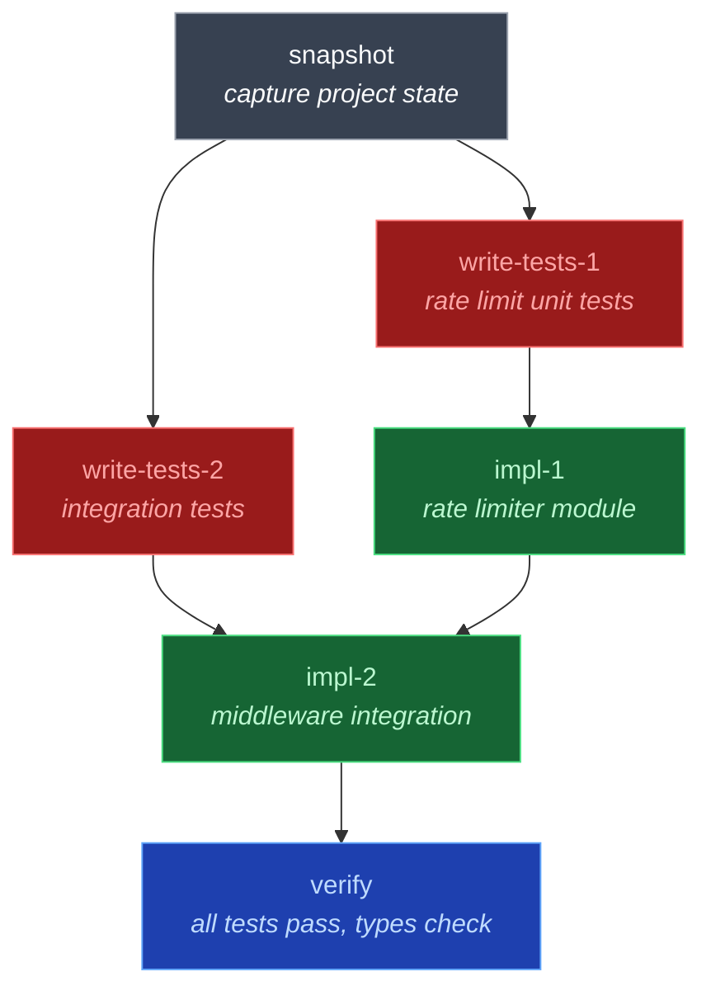
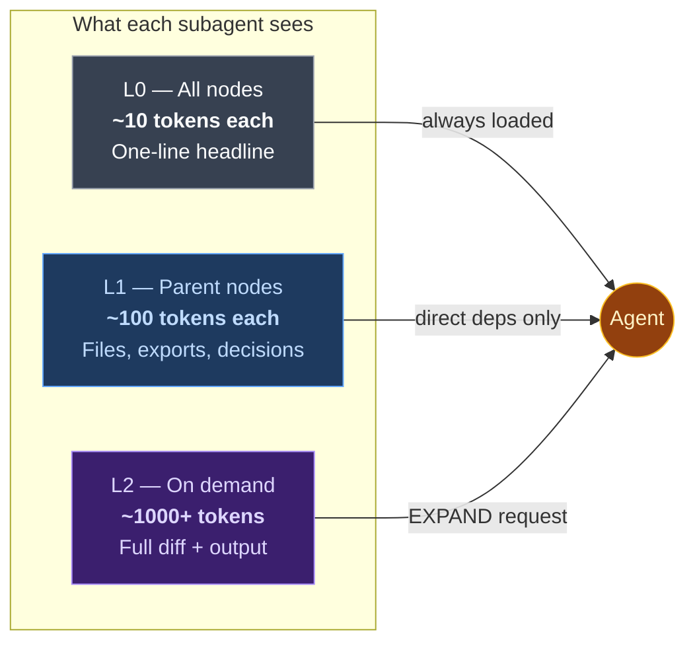
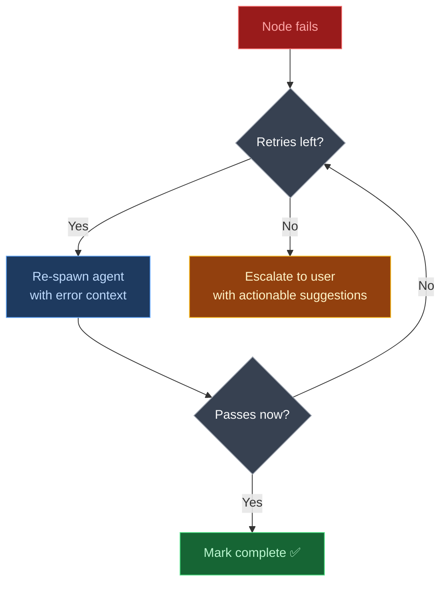

<div align="center">

# Specwork

### Stop babysitting your AI agent.

[](https://www.npmjs.com/package/specwork)
[](LICENSE)
[](https://nodejs.org)

_A spec-driven workflow engine that keeps AI agents focused, scoped, and honest — from first test to final commit._

</div>

---

## You've been here before

You ask your AI agent to add authentication to your API. It starts strong — writes a few files, sets up a middleware. Then somewhere around step 4, it quietly modifies your database schema. By step 7, it's forgotten why it started. You scroll through 200 lines of changes and realize half of them are wrong.

You re-explain the goal. It apologizes. It drifts again.

**The bigger the task, the worse this gets.** Context fades. Scope creeps. Tests get skipped "to save time." You end up doing more work managing the agent than you would have writing the code yourself.

This is the problem Specwork was built to solve.

---

## What if the agent couldn't drift?

Specwork breaks your change into a graph of small, verifiable steps. At every step, the agent knows exactly what to do and exactly what "done" looks like.

```
  "Add JWT authentication to the API"
                  │
                  ▼
    ┌─────────────────────────┐
    │    specwork plan         │   You describe the change in plain English.
    │                         │   Specwork creates specs, design, and tasks.
    └────────────┬────────────┘
                 ▼
    ┌─────────────────────────┐
    │    specwork go           │   The engine takes over:
    │                         │
    │    📸 snapshot           │   Captures project state
    │    🔴 write tests       │   Tests first — they MUST fail
    │    🟢 implement         │   Make tests pass, nothing more
    │    ✅ verify            │   Type-check + test-pass every step
    │    📦 commit            │   Atomic commits per node
    └─────────────────────────┘
```

The agent never sees the full workflow. It gets one instruction at a time — with a reminder of the original goal baked into every step. It can't skip ahead. It can't wander off.

---

## A real example

Let's say you run:

```bash
specwork plan "Add rate limiting to the /api/upload endpoint"
```

Specwork creates a change proposal, then generates a graph like this:



Each node has:

- **Validation rules** — what must be true when it's done
- **Context tier** — just enough info from previous nodes, never a full dump

Now run `specwork go add-rate-limiting` and watch it execute — node by node, test-first, verified.

---

## Three things that make it work

### 1. Gradual reveal — one step at a time

Instead of front-loading a 500-line instruction manual (which the agent will forget by step 3), Specwork feeds the next instruction embedded in each CLI response:

```json
{
  "status": "ready",
  "next_action": {
    "command": "team:spawn",
    "description": "Spawn teammates for ready nodes",
    "context": "Add rate limiting to /api/upload"
  }
}
```

The agent doesn't need to remember the full plan. It follows `next_action`. That's it.

### 2. Context reinforcement — the goal never fades

Every `next_action` carries a `context` field pulled from your original description. At every state transition, the agent is reminded _why_ it's doing what it's doing. No more "wait, what was I building again?"

### 3. Progressive context — no information overload



Subagents get exactly what they need. Not a conversation dump. Not "here's everything that happened." Just the relevant facts, at the right granularity. If they need more, they ask with `EXPAND(node-id)` — once.

---

## Quick start

**Prerequisites:** [Claude Code](https://docs.anthropic.com/en/docs/claude-code) with Agent Teams support + Node.js >= 18

```bash
# Install
npm install -g specwork

# Initialize (one-time, in your project root)
specwork init

# Plan a change
specwork plan "Add JWT authentication to the API"

# Run the workflow
specwork go add-jwt-authentication

# Check progress anytime
specwork status
```

Or use Claude Code slash commands:

```
/specwork-plan "Add JWT authentication"
/specwork-go add-jwt-authentication
/specwork-status
```

> **Note:** Specwork currently requires Claude Code with Agent Teams support. It uses `TeamCreate`/`TeamDelete`, subagent spawning, hooks, and skills — all Claude Code primitives.

---

## What happens when things fail



Every failure path has a `next_action`. The agent never spirals. It either fixes the problem or hands it to you with context about what went wrong and what to try.

---

<details>
<summary><h2>CLI Reference</h2></summary>

| Command                                  | Description                                                         |
| ---------------------------------------- | ------------------------------------------------------------------- |
| `specwork init`                          | Initialize project (creates `.specwork/` + Claude Code integration) |
| `specwork plan "<description>"`          | Create a new change from plain English                              |
| `specwork go <change>`                   | Run the workflow autonomously                                       |
| `specwork status [change]`               | Show progress for all or a specific change                          |
| `specwork graph generate <change>`       | Generate DAG from tasks                                             |
| `specwork graph show <change>`           | Display the node graph                                              |
| `specwork node start <change> <node>`    | Start a specific node                                               |
| `specwork node complete <change> <node>` | Mark a node complete                                                |
| `specwork node fail <change> <node>`     | Mark a node failed                                                  |
| `specwork node verify <change> <node>`   | Run verification checks                                             |
| `specwork archive <change>`              | Archive a completed change                                          |
| `specwork doctor [change]`               | Health-check project or change artifacts                            |

All commands support `--json` for machine-readable output with `next_action` guidance.

</details>

<details>
<summary><h2>Architecture</h2></summary>

```
.specwork/
├── config.yaml              # Engine + spec configuration
├── specs/                   # Source-of-truth behavior specs
├── changes/                 # In-flight changes (proposal + specs + design + tasks)
│   └── <change-name>/
├── graph/<change>/
│   ├── graph.yaml           # Node DAG (dependencies, scope, validation)
│   └── state.yaml           # Runtime state (status per node)
├── nodes/<change>/          # Per-node artifacts (L0/L1/L2, verify output)
└── templates/               # Starter templates for proposals, specs, design, tasks

.claude/
├── agents/                  # Subagent definitions (test-writer, implementer, verifier, summarizer)
├── skills/                  # Engine logic (specwork-engine, specwork-context)
├── commands/                # Slash commands (specwork-plan, specwork-go, specwork-status)
└── hooks/                   # Lifecycle hooks (type-check, node-complete)
```

### Subagents

| Agent                  | Model  | Role                                                      |
| ---------------------- | ------ | --------------------------------------------------------- |
| `specwork-test-writer` | opus   | Writes tests from specs — must all fail (RED)             |
| `specwork-implementer` | sonnet | Makes tests pass, minimum code                            |
| `specwork-verifier`    | haiku  | Read-only validation: type-check, tests pass, files exist |
| `specwork-summarizer`  | haiku  | Generates L0/L1/L2 context after each node                |

### Node types

- **`deterministic`** — Runs a shell command. Captures stdout/stderr, validates exit code.
- **`llm`** — Spawns a subagent with validation rules.
- **`human`** — Pauses execution for manual approval.

</details>

<details>
<summary><h2>Configuration</h2></summary>

`.specwork/config.yaml`:

```yaml
models:
  default: sonnet
  test_writer: opus
  verifier: haiku
  summarizer: haiku

execution:
  max_retries: 2
  expand_limit: 1
  parallel_mode: parallel
  snapshot_refresh: after_each_node

context:
  ancestors: L0
  parents: L1

spec:
  specs_dir: .specwork/specs
  changes_dir: .specwork/changes
  templates_dir: .specwork/templates
```

</details>

<details>
<summary><h2>Spec conventions</h2></summary>

Specs describe **behavior**, not implementation. No class names, no library choices — just what the system should do.

```markdown
### Requirement: Token Validation

The system SHALL reject expired JWT tokens with a 401 status code.

#### Scenario: Expired token submitted

- **GIVEN** a JWT token with `exp` in the past
- **WHEN** the token is submitted to any authenticated endpoint
- **THEN** the system responds with HTTP 401 and error body `{"error": "token_expired"}`
```

Keywords: `SHALL/MUST` (absolute requirement), `SHOULD` (recommended).

Specs live in `.specwork/specs/` (source of truth) and `.specwork/changes/` (proposed deltas).

</details>

---

## Credits

Specwork's spec convention system is based on [OpenSpec](https://github.com/Fission-AI/OpenSpec) by [Fission AI](https://github.com/Fission-AI).

## Contributing

See [CONTRIBUTING.md](CONTRIBUTING.md) for dev setup, PR process, and code style.

## License

MIT — see [LICENSE](LICENSE).
