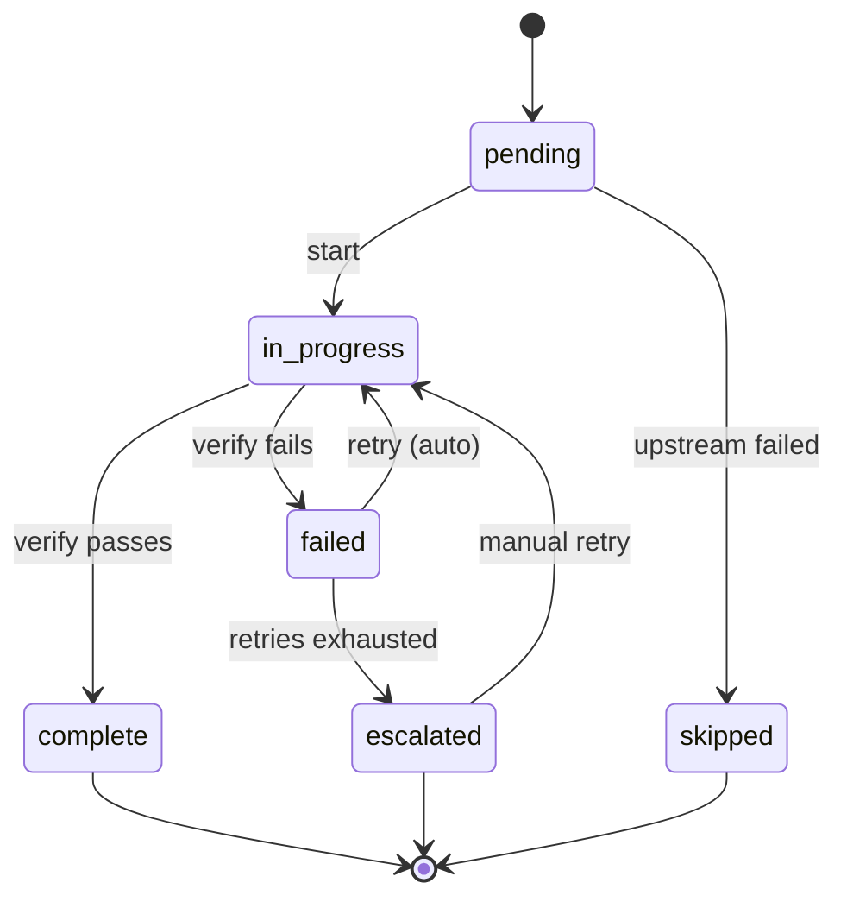
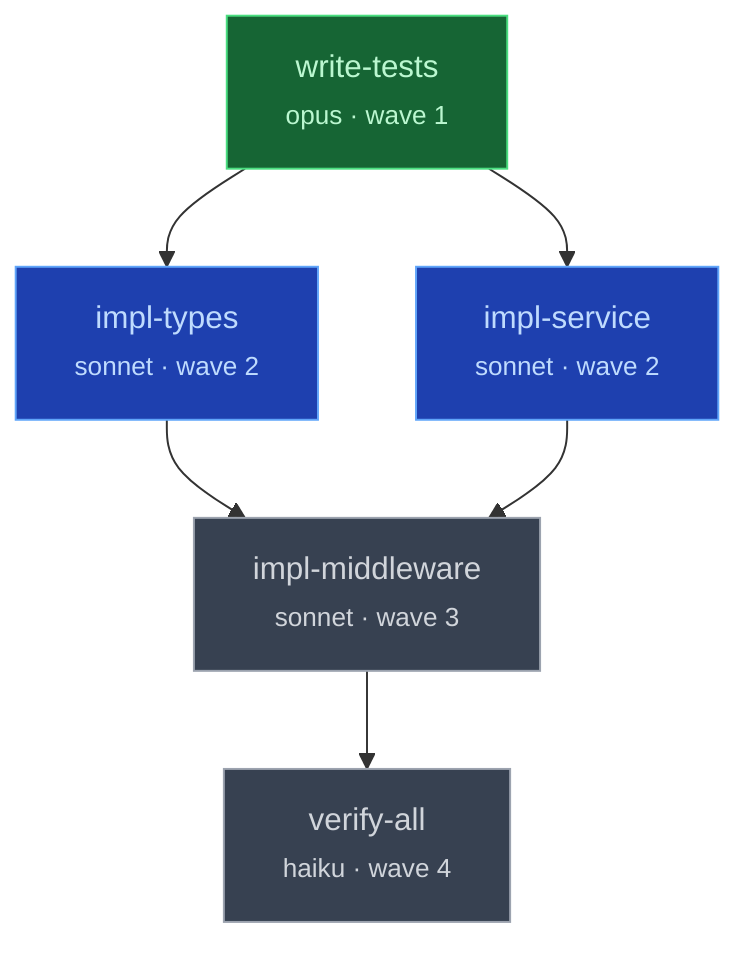
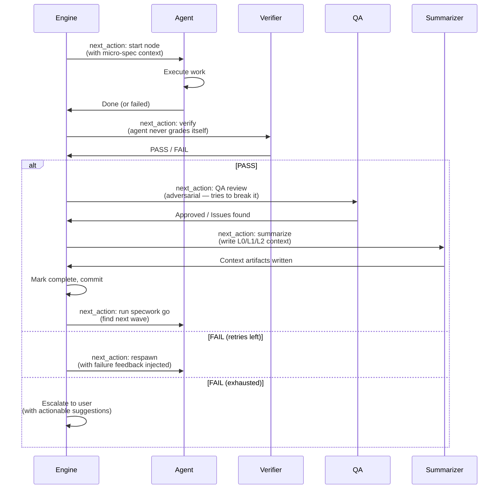
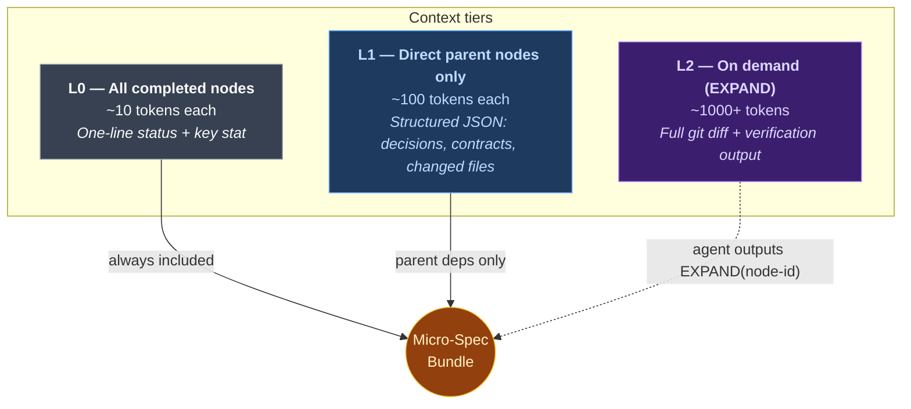

<div align="center">

# Specwork

### Stop babysitting your AI agent.

[](https://www.npmjs.com/package/specwork)
[](LICENSE)
[](https://nodejs.org)

*A spec-driven workflow engine that keeps AI agents focused, verified, and honest — from first test to final commit.*

</div>

---

## You've been here before

You ask your AI agent to add authentication to your API. It starts strong — writes a few files, sets up a middleware. Then somewhere around step 4, it quietly modifies your database schema. By step 7, it's forgotten why it started. You scroll through 200 lines of changes and realize half of them are wrong.

You re-explain the goal. It apologizes. It drifts again.

**The bigger the task, the worse this gets.** Context fades. Tests get skipped "to save time." The agent leaves behind `// TODO: implement this` and marks the task complete. You end up doing more work managing the agent than you would have writing the code yourself.

This is the problem Specwork was built to solve.

---

## The core idea: a workflow engine for AI agents

Specwork doesn't give the agent a plan and hope for the best. It runs a **state machine** — each unit of work is a node that transitions through a strict lifecycle. The agent never sees the full workflow. It receives one instruction at a time, embedded in the output of each CLI command.


```mermaid
stateDiagram-v2
    [*] --> pending
    pending --> in_progress : start
    pending --> skipped : upstream failed

    in_progress --> complete : verify passes
    in_progress --> failed : verify fails

    failed --> in_progress : retry (auto)
    failed --> escalated : retries exhausted

    escalated --> in_progress : manual retry

    complete --> [*]
    skipped --> [*]
    escalated --> [*]
```

Every transition produces a **`next_action`** — a concrete instruction telling the agent exactly what to do next. The agent doesn't plan. It doesn't improvise. It follows `next_action`.

---

## How `next_action` drives everything

When the agent runs any `specwork` command, the JSON response includes a `next_action` field. This is the engine's steering wheel. The agent reads it, executes it, and the cycle repeats.

```
┌──────────────────────────────────────────────────────────────────┐
│                                                                  │
│   Agent runs command  ──►  Engine returns next_action            │
│          ▲                          │                            │
│          │                          ▼                            │
│          └────────  Agent executes next_action                   │
│                                                                  │
└──────────────────────────────────────────────────────────────────┘
```

Here's what that looks like in practice. The agent runs `specwork go`:

```json
{
  "status": "ready",
  "ready": ["write-tests", "impl-types"],
  "wave": 1,
  "progress": { "complete": 1, "total": 6, "failed": 0 },
  "next_action": {
    "command": "team:spawn",
    "description": "Spawn one teammate per ready node: write-tests, impl-types",
    "context": "Add JWT authentication to the API"
  }
}
```

The agent doesn't need memory of the overall plan. It reads `command`, sees `"team:spawn"`, spawns the teammates. Done. When a teammate finishes, it runs verify:

```json
{
  "verdict": "PASS",
  "next_action": {
    "command": "subagent:spawn",
    "description": "Spawn summarizer to write L0/L1/L2 context, then complete the node.",
    "on_pass": "specwork node complete add-jwt-auth impl-types",
    "on_fail": "specwork node fail add-jwt-auth impl-types --reason '<error>'"
  }
}
```

And when verification fails:

```json
{
  "verdict": "FAIL",
  "checks": [
    { "type": "tests-pass", "status": "FAIL", "detail": "3 of 12 tests failing" },
    { "type": "no-deferred-work", "status": "FAIL", "detail": "Found TODO in src/auth.ts:42" }
  ],
  "next_action": {
    "command": "subagent:respawn",
    "description": "1 retry remaining. Re-spawn with failure feedback.",
    "context": "Add JWT authentication to the API"
  }
}
```

Notice: every response carries `context` — the original goal, pulled from your description. At every state transition, the agent is reminded *why* it's doing what it's doing. The goal never fades.

---

## Wave-based execution

Specwork models your change as a DAG (directed acyclic graph). The engine walks it in **waves** — batches of nodes whose dependencies are all satisfied, capped by `max_concurrent` (default: 5).


```mermaid
graph TD
    S["write-tests<br/><small>opus · wave 1</small>"]:::done --> I1["impl-types<br/><small>sonnet · wave 2</small>"]:::active
    S --> I2["impl-service<br/><small>sonnet · wave 2</small>"]:::active
    I1 --> I3["impl-middleware<br/><small>sonnet · wave 3</small>"]:::pending
    I2 --> I3
    I3 --> V["verify-all<br/><small>haiku · wave 4</small>"]:::pending

    classDef done fill:#166534,stroke:#4ADE80,color:#BBF7D0
    classDef active fill:#1E40AF,stroke:#60A5FA,color:#BFDBFE
    classDef pending fill:#374151,stroke:#9CA3AF,color:#D1D5DB
```

Each wave completes and commits before the next starts. This means:
- **No agent conflicts** — agents in the same wave work on distinct files, and the next wave sees a clean git state
- **Natural review points** — you can inspect the results after each wave before the engine continues
- **Bounded cost** — no unbounded parallelism; `max_concurrent` controls how many agents run at once

If a node fails and exhausts its retries, the engine **cascades skip** — all downstream nodes are marked `skipped`, so the agent doesn't waste time on work that can't succeed.

---

## The node lifecycle

Every node — whether it's writing tests, implementing code, or running a shell command — follows the same lifecycle:


```mermaid
sequenceDiagram
    participant E as Engine
    participant A as Agent
    participant V as Verifier
    participant Q as QA
    participant S as Summarizer

    E->>A: next_action: start node<br/>(with micro-spec context)
    A->>A: Execute work
    A->>E: Done (or failed)
    E->>V: next_action: verify<br/>(agent never grades itself)
    V->>E: PASS / FAIL

    alt PASS
        E->>Q: next_action: QA review<br/>(adversarial — tries to break it)
        Q->>E: Approved / Issues found
        E->>S: next_action: summarize<br/>(write L0/L1/L2 context)
        S->>E: Context artifacts written
        E->>E: Mark complete, commit
        E->>A: next_action: run specwork go<br/>(find next wave)
    else FAIL (retries left)
        E->>A: next_action: respawn<br/>(with failure feedback injected)
    else FAIL (exhausted)
        E->>E: Escalate to user<br/>(with actionable suggestions)
    end
```

Three critical rules:

1. **The implementer never grades its own homework.** After every node, a separate verifier agent checks the work — type errors, test results, file existence, and deferred work scanning.
2. **Tests before implementation.** The `write-tests` node always runs first. Tests must fail (red state) before any implementation begins.
3. **No deferred work.** `TODO`, `FIXME`, `STUB`, and `// not implemented` are automatically detected and blocked. If it's in the diff, the node fails verification. There is no later — every node must be complete before it's marked complete.

---

## Micro-spec context: how nodes share knowledge

When a subagent starts working on a node, it doesn't receive the full conversation history or a raw context dump. It gets a **micro-spec** — a curated, node-specific document assembled from six structured sections:

```
┌─────────────────────────────────────────────────┐
│  MICRO-SPEC for impl-service                    │
├─────────────────────────────────────────────────┤
│  1. Objective                                   │
│     "Implement the auth service"                │
│                                                 │
│  2. Spec Scenarios                              │
│     ### Requirement: Token Validation           │
│     #### Scenario: Expired token submitted      │
│     ...                                         │
│                                                 │
│  3. Parent Decisions (structured L1)            │
│     write-tests: 23 tests, 0 passing            │
│     impl-types: exported JwtPayload, AuthConfig │
│     Decision: discriminated union for tokens    │
│                                                 │
│  4. Scope                                       │
│     src/services/auth.ts                        │
│     src/middleware/jwt.ts                        │
│                                                 │
│  5. Completed Nodes (L0)                        │
│     write-tests: complete, 23 tests (all red)   │
│     impl-types: complete, 2 interfaces          │
│                                                 │
│  6. Validation Checks                           │
│     ✓ tests-pass  ✓ no-deferred-work            │
│     ✓ type-check                                │
└─────────────────────────────────────────────────┘
```

**Why this matters:** A 10-node workflow could easily consume 50K+ tokens of context if you dump everything. With micro-specs, the same workflow uses ~2K tokens per node — and each agent knows exactly which spec scenarios it's responsible for, what its parents decided, and what sibling nodes own (so it doesn't step on their work).

### The L0 / L1 / L2 tiers behind micro-specs


```mermaid
graph TB
    subgraph "Context tiers"
        L0["<b>L0 — All completed nodes</b><br/>~10 tokens each<br/><i>One-line status + key stat</i>"]
        L1["<b>L1 — Direct parent nodes only</b><br/>~100 tokens each<br/><i>Structured JSON: decisions, contracts, changed files</i>"]
        L2["<b>L2 — On demand (EXPAND)</b><br/>~1000+ tokens<br/><i>Full git diff + verification output</i>"]
    end

    L0 -->|always included| Bundle((Micro-Spec<br/>Bundle))
    L1 -->|parent deps only| Bundle
    L2 -.->|"agent outputs EXPAND(node-id)"| Bundle

    style L0 fill:#374151,stroke:#9CA3AF,color:#F9FAFB
    style L1 fill:#1E3A5F,stroke:#60A5FA,color:#BFDBFE
    style L2 fill:#3B1F6E,stroke:#A78BFA,color:#DDD6FE
    style Bundle fill:#92400E,stroke:#FBBF24,color:#FEF3C7
```

Every completed node gets an L0 headline, an L1 structured summary (decisions, contracts, changed files), and an L2 full artifact. The micro-spec composer pulls from these tiers to build exactly the right context for each node.

---

## Sandbox: environment setup before agents run

Agents shouldn't fail because the dev server isn't running or dependencies aren't installed. Specwork's **sandbox system** auto-detects your project infrastructure and ensures everything is ready before subagents execute.

```bash
# Auto-detect what your project needs
specwork sandbox detect

# Start everything (deps, dev servers, databases)
specwork sandbox init

# Check what's running
specwork sandbox status

# Clean up (only kills sandbox-started processes)
specwork sandbox teardown
```

The sandbox detects: **package managers** (npm/yarn/pnpm), **test runners** (vitest/jest/mocha), **e2e frameworks** (playwright/cypress), **Docker services** (reads docker-compose.yaml), **dev scripts**, and **.env files**. Services start in dependency order with ready checks. PID tracking ensures only sandbox-started processes are killed on teardown — your other terminals stay untouched.

The engine triggers sandbox init automatically before subagent spawn and teardown after verification completes.

---

## Plan visualization

Before running `specwork go`, review the full plan in your browser:

```bash
specwork viz add-jwt-auth
```

This generates an interactive HTML page at `.specwork/changes/<change>/overview.html` with:
- A **Mermaid DAG** showing all nodes, dependencies, and types
- The **proposal** (why this change exists)
- **Spec requirements** mapped to each node
- **Node detail panels** with scope, agent, and validation rules

Review the plan visually, then run `specwork go` when you're confident.

---

## Quick start

**Prerequisites:** [Claude Code](https://docs.anthropic.com/en/docs/claude-code) with Agent Teams support + Node.js >= 18

```bash
# Install
npm install -g specwork

# Initialize (one-time, in your project root)
specwork init

# Plan a change
specwork plan "Add JWT authentication to the API"

# Review the plan visually
specwork viz add-jwt-authentication

# Run the workflow
specwork go add-jwt-authentication

# Check progress anytime
specwork status
```

Or use Claude Code slash commands:

```
/specwork-plan "Add JWT authentication"
/specwork-go add-jwt-authentication
/specwork-status
```

---

<details>
<summary><h2>CLI Reference</h2></summary>

### Workflow commands

| Command | Description |
| --- | --- |
| `specwork init` | Initialize project (creates `.specwork/` + all Claude Code integration files) |
| `specwork plan "<description>"` | Create a new change from plain English |
| `specwork go <change>` | Run the workflow autonomously (wave-based execution) |
| `specwork status [change]` | Show progress for all or a specific change |
| `specwork update` | Update project files to the current specwork version (with backups) |
| `specwork archive <change>` | Archive a completed change (promotes specs, generates summary) |
| `specwork viz <change>` | Generate and open interactive HTML plan visualization |
| `specwork doctor [change]` | Health-check project or change artifacts |

### Sandbox commands

| Command | Description |
| --- | --- |
| `specwork sandbox detect` | Auto-detect project type, services, and infrastructure |
| `specwork sandbox init [change]` | Start sandbox environment (deps, servers, databases) |
| `specwork sandbox teardown [change]` | Stop only sandbox-started processes |
| `specwork sandbox status` | Show running sandbox services and ports |

### Node and graph commands (used by the engine)

| Command | Description |
| --- | --- |
| `specwork node start <change> <node>` | Start a specific node (injects micro-spec context) |
| `specwork node complete <change> <node>` | Mark a node complete |
| `specwork node fail <change> <node>` | Mark a node failed |
| `specwork node verify <change> <node>` | Run verification checks |
| `specwork graph generate <change>` | Generate DAG from tasks |
| `specwork graph show <change>` | Display the node graph |
| `specwork run <change>` | Find ready nodes and output execution plan |
| `specwork retry <change/node>` | Reset a failed/escalated node to pending |
| `specwork report <change>` | Full markdown report with L0/L1 summaries and metrics |
| `specwork log <change> [node]` | Show node L2 detail or all L0 headlines |
| `specwork context assemble <change> <node>` | Inspect the assembled micro-spec for a node |

### Utility commands

| Command | Description |
| --- | --- |
| `specwork new <change>` | Create a new change from templates (without planning agent) |
| `specwork config` | Read and update Specwork configuration |

All commands support `--json` for machine-readable output with `next_action` guidance.

</details>

<details>
<summary><h2>Architecture</h2></summary>

```
.specwork/
├── config.yaml              # Engine + spec configuration
├── manifest.yaml            # SHA256 checksums of managed files (for specwork update)
├── sandbox.yaml             # Sandbox environment configuration
├── schema.yaml              # Artifact dependency graph
├── specs/                   # Source-of-truth behavior specs
├── changes/                 # In-flight changes (proposal + specs + design + tasks + overview.html)
│   └── archive/             # Completed changes (auto-archived)
├── graph/<change>/
│   ├── graph.yaml           # Node DAG (dependencies, scope, validation rules)
│   └── state.yaml           # Runtime state (status, wave, retries per node)
├── nodes/<change>/          # Per-node artifacts (L0/L1/L2, L1-structured.json, verify.md)
├── sandbox/                 # Sandbox runtime state (PIDs, ports)
├── backups/                 # Pre-update backups by version
├── templates/               # Starter templates for proposals, specs, design, tasks
└── examples/                # Example graphs for reference

.claude/
├── agents/                  # Subagent definitions (6 roles)
├── skills/                  # Engine logic (specwork-engine, specwork-context, specwork-conventions)
├── commands/                # Slash commands (specwork-plan, specwork-go, specwork-status)
└── hooks/                   # Lifecycle hooks (type-check, session-init, node-complete)
```

### Subagents

| Agent | Model | Role |
| --- | --- | --- |
| `specwork-planner` | sonnet | Explores codebase, asks clarifying questions, generates proposal/specs/design/tasks |
| `specwork-test-writer` | opus | Writes tests from specs — must all fail (RED state). No stubs allowed. |
| `specwork-implementer` | sonnet | Makes tests pass with minimum code. No TODOs, no deferred work. |
| `specwork-qa` | sonnet | Adversarial QA — tries to break the output. Checks edge cases, regressions, spec compliance. Read-only. |
| `specwork-verifier` | haiku | Read-only validation: type-check, tests pass, scope check, no-deferred-work scan |
| `specwork-summarizer` | haiku | Generates L0/L1/L2 context and structured L1 JSON after each node |

### Node types

- **`deterministic`** — Runs a shell command. Captures stdout/stderr, validates exit code.
- **`llm`** — Spawns a subagent with micro-spec context and validation rules.
- **`human`** — Pauses execution for manual approval.

### State machine

Every node tracks: `status`, `retries`, `verified`, `l0` (headline), `start_sha` (git baseline for tsc-check), `wave` (execution batch), and a full `verify_history` with regression detection.

Terminal states: `complete`, `skipped`, `rejected`. Retryable: `failed` → `in_progress`. Escalatable: `escalated` → `in_progress` (manual via `specwork retry`).

</details>

<details>
<summary><h2>Configuration</h2></summary>

`.specwork/config.yaml`:

```yaml
models:
  default: sonnet
  test_writer: opus
  verifier: haiku
  summarizer: haiku

execution:
  max_retries: 2        # Retry failed nodes up to N times
  expand_limit: 1       # Max EXPAND requests per node
  parallel_mode: parallel
  snapshot_refresh: after_each_node
  verify: gates         # Verification mode (gates = block on fail)

context:
  ancestors: L0         # All completed nodes get L0
  parents: L1           # Direct deps get L1 (structured JSON)

spec:
  specs_dir: .specwork/specs
  changes_dir: .specwork/changes
  archive_dir: .specwork/changes/archive
  templates_dir: .specwork/templates

graph:
  graphs_dir: .specwork/graph
  nodes_dir: .specwork/nodes

environments:
  env_dir: .specwork/env
  active: development
```

### Version migration

When you upgrade specwork, run `specwork update` to bring your project files forward:

```bash
specwork update           # Apply updates (with automatic backups)
specwork update --dry-run # Preview what would change
```

The update system uses a SHA256 manifest to detect which files you've customized vs. which are stock — it won't overwrite your modifications without telling you. Version-specific migrations run automatically in semver order.

</details>

<details>
<summary><h2>Spec conventions</h2></summary>

Specs describe **behavior**, not implementation. No class names, no library choices — just what the system should do.

```markdown
### Requirement: Token Validation

The system SHALL reject expired JWT tokens with a 401 status code.

#### Scenario: Expired token submitted

- **GIVEN** a JWT token with `exp` in the past
- **WHEN** the token is submitted to any authenticated endpoint
- **THEN** the system responds with HTTP 401 and error body `{"error": "token_expired"}`
```

Keywords: `SHALL/MUST` (absolute requirement), `SHOULD` (recommended).

Specs live in `.specwork/specs/` (source of truth) and `.specwork/changes/` (proposed deltas). When a change is archived, its specs are promoted to the source of truth.

</details>

---

## Credits

Specwork's spec convention system is based on [OpenSpec](https://github.com/Fission-AI/OpenSpec) by [Fission AI](https://github.com/Fission-AI).

## Contributing

See [CONTRIBUTING.md](CONTRIBUTING.md) for dev setup, PR process, and code style.

## License

MIT — see [LICENSE](LICENSE).
